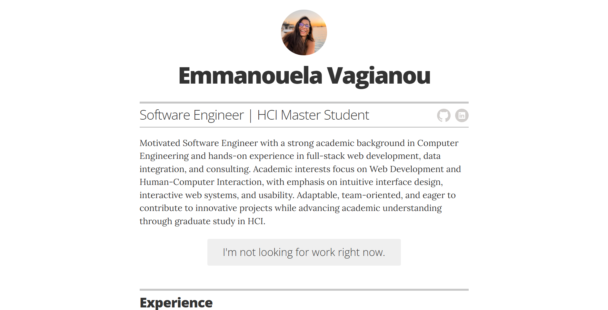

# Emmanouela Vagianou Resume Website

This repository contains the source code and data for Emmanouela Vagianou's resume website, built with Jekyll and GitHub Pages. It supports automatic PDF generation from YAML data using Ruby, Pandoc, and wkhtmltopdf, with continuous integration via GitHub Actions.



## Features
- Resume data stored in YAML files under `_data/`
- Jekyll site for web-based resume
- Ruby script (`yaml_to_md.rb`) to convert YAML data to Markdown (`cv.md`)
- Automatic PDF generation:
	- `EmmanouelaVagianou.pdf`: Styled PDF from the deployed HTML (matches website look)
	- `cv.pdf`: Simple A4 PDF from Markdown using Pandoc
- GitHub Actions workflow to regenerate and commit PDFs on every YAML/config change

## Local Development

### Prerequisites
- Ruby (3.2 recommended)
- Bundler
- Jekyll
- Pandoc
- wkhtmltopdf

### Setup
1. Install dependencies:
	 ```sh
	 gem install bundler
	 bundle install
	 ```
2. Serve the site locally:
	 ```sh
	 bundle exec jekyll serve
	 ```
3. Generate Markdown CV from YAML:
	 ```sh
	 ruby yaml_to_md.rb
	 ```
4. Generate PDFs:
	 - From HTML (styled):
		 ```sh
		 wkhtmltopdf http://localhost:4000/index.html EmmanouelaVagianou.pdf
		 ```
	 - From Markdown (A4):
		 ```sh
		 pandoc cv.md -o cv.pdf --pdf-engine=wkhtmltopdf -V geometry:a4paper
		 ```

## Continuous Integration
- See `.github/workflows/cv-pdf.yml` for the GitHub Actions workflow.
- On every push to YAML files or `_config.yml`, the workflow:
	- Regenerates `cv.md` from YAML
	- Builds the Jekyll site
	- Generates both PDFs
	- Commits and pushes the updated PDFs to the repository

## Directory Structure
```
├── _config.yml
├── _data/
│   ├── associations.yml
│   ├── education.yml
│   ├── experience.yml
│   ├── interests.yml
│   ├── links.yml
│   ├── projects.yml
│   ├── recognitions.yml
│   └── skills.yml
├── _includes/
├── _layouts/
├── _sass/
├── css/
├── images/
├── index.html
├── Gemfile
├── Gemfile.lock
├── yaml_to_md.rb
├── cv.md
├── EmmanouelaVagianou.pdf
├── cv.pdf
└── .github/
		└── workflows/
				└── cv-pdf.yml
```

## License
See [LICENSE](LICENSE).

---

For questions or contributions, please open an issue or pull request.